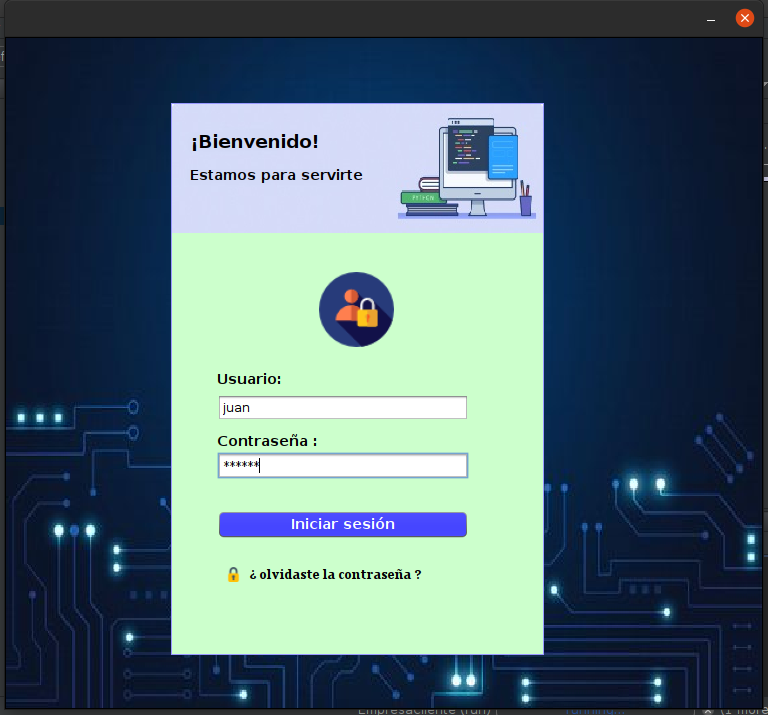
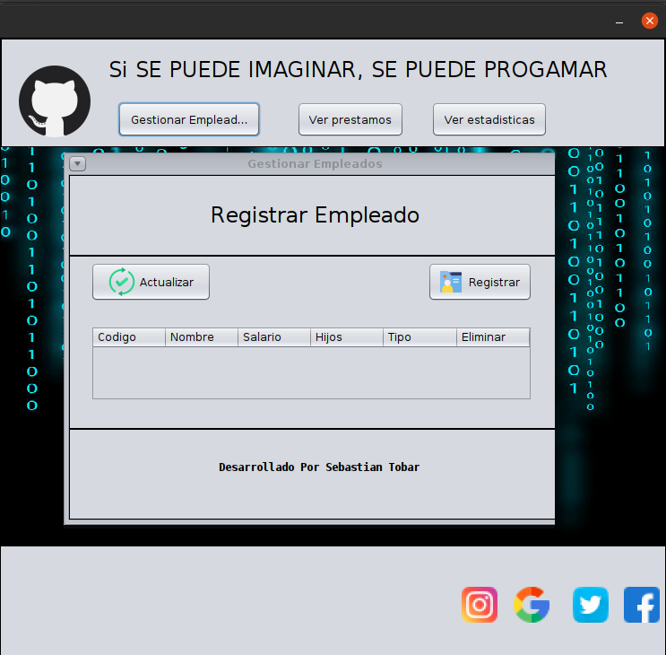
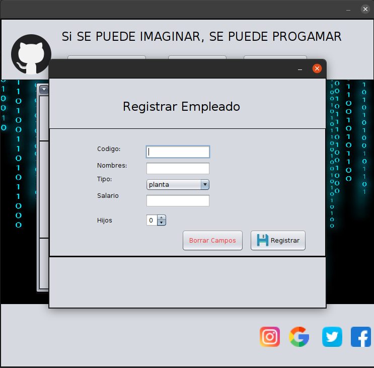
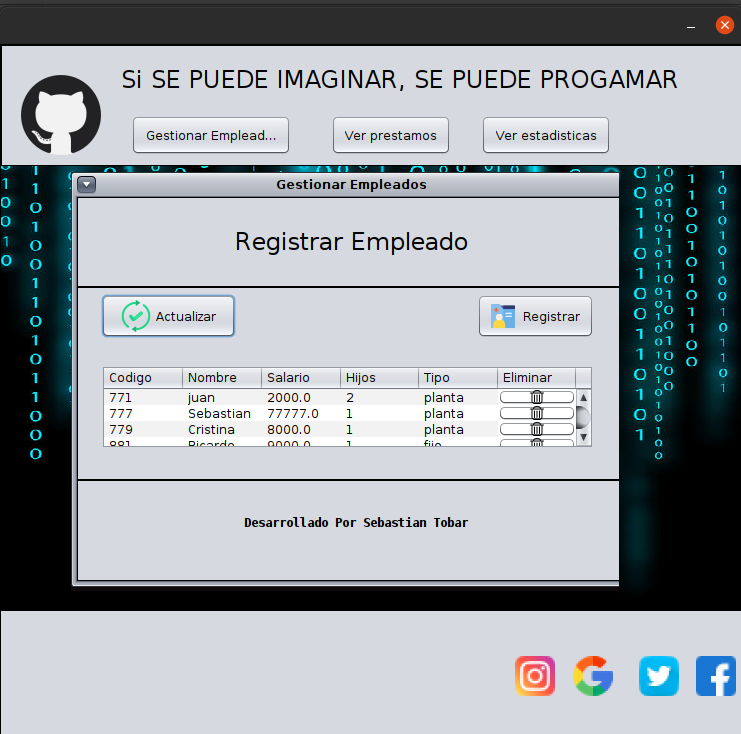

# EmpresaGUI
Interfaz Grafica con java.swing y bases de datos con SQL y con la Arquitectura Cliente-Servidor
el cual podremos registrar empleados, actualizar empleados y eliminar empleados de la base de datos mediante la interfaz grafica

